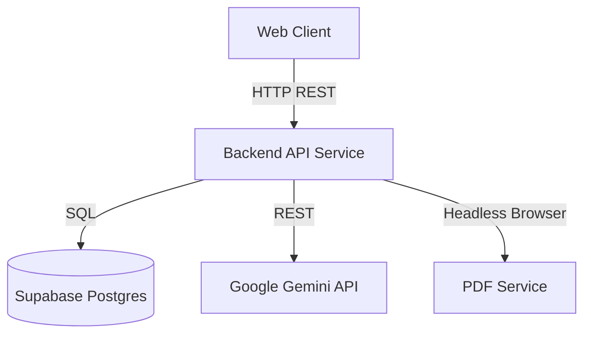

# C4 Component: Backend API Service

## Overview
- **Name**: Career-Hero API Service
- **Type**: RESTful API / Microservice
- **Technology**: Python, Flask, Gunicorn
- **Description**: The core backend application logic handling user requests, AI processing, and data persistence.

## Purpose
- Provide a secure API for frontend interactions.
- Abstract interactions with third-party services (Google Gemini, Supabase).
- Handle resource-intensive tasks such as PDF rendering and resume parsing.
- Enforce business rules and authentication (JWT).

## Key Components (Modules)

### 1. Auth Module (`auth_user_service`)
- **Responsibility**: Authenticates users (Email/Password), manages sessions via JWT tokens, handles password reset.
- **Interfaces**: `/api/auth/*` (register, login, forgot-password).

### 2. Resume Management Module (`resume_crud_service`)
- **Responsibility**: CRUD operations for user resumes. Ensures data sanitization and strict ownership validation.
- **Interfaces**: `/api/resumes/*` (GET, POST, PUT, DELETE).

### 3. AI Analysis Module (`ai_endpoint_service`)
- **Responsibility**: Connects to Google Gemini API for resume scoring, suggestion generation, and conversational interview simulation.
- **Interfaces**: `/api/ai/*` (analyze, chat, parse-resume).

### 4. PDF Generation Module (`pdf_service` / `export_service`)
- **Responsibility**: Generates professional PDF resumes using Playwright for high-fidelity rendering of React components.
- **Interfaces**: `/api/export-pdf`.

### 5. RAG (Retrieval-Augmented Generation) Module (`rag_service`)
- **Responsibility**: Enhances AI responses with context from a knowledge base (vector store) of successful resumes and job descriptions.

## Relationships
- **Consumes**:
    - **Supabase Database**: Stores user profiles, resume JSON data.
    - **Supabase Auth**: Stores user credentials.
    - **Google Gemini API**: Generates text and analysis.
- **Serving**:
    - **Frontend Web App**: Provides data via JSON APIs.

## Diagram

