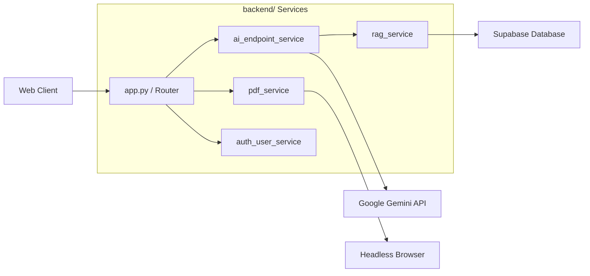

# C4 Component: Backend Service (Decoupled Architecture)

## 1. Overview
The Career-Hero Backend has been refactored from a monolithic `app.py` into a modular service-oriented architecture located in the `backend/services/` directory.

## 2. Key Components

### 2.1 API Route Handler (`app.py`)
- **Role**: Main entry point and router.
- **Responsibilities**:
    - Initializes Flask and Cross-Origin Resource Sharing (CORS).
    - Maps URL paths to service functions.
    - Implements JWT middleware for protected routes.

### 2.2 AI Orchestrator (`ai_endpoint_service.py`)
- **Role**: Interface with Gemini 3.0.
- **Responsibilities**:
    - Manages complex Prompts for Analysis and Interviewing.
    - Handles stream generation for the conversational interface.
    - Adapts to different Gemini models (Flash/Pro) based on task.

### 2.3 RAG Strategy Engine (`rag_service.py`)
- **Role**: Intelligent data retrieval.
- **Responsibilities**:
    - **Adaptive Routing**: Decides RAG intensity based on the candidate's industry (e.g., strong RAG for tech, weak for creative).
    - **Vector Matching**: Interacts with `pgvector` to find relevant high-performing cases.

### 2.4 PDF Rendering Service (`pdf_service.py`)
- **Role**: High-fidelity export.
- **Responsibilities**:
    - Launches headless Playwright instances.
    - Renders the frontend template with production data to generate perfect PDFs.

### 2.5 Auth & User Service (`auth_user_service.py`)
- **Role**: Identity Management.
- **Responsibilities**:
    - Handles registration, login, and profile updates.
    - Manages password hashing and JWT token issuance.

## 3. Relationship Diagram

