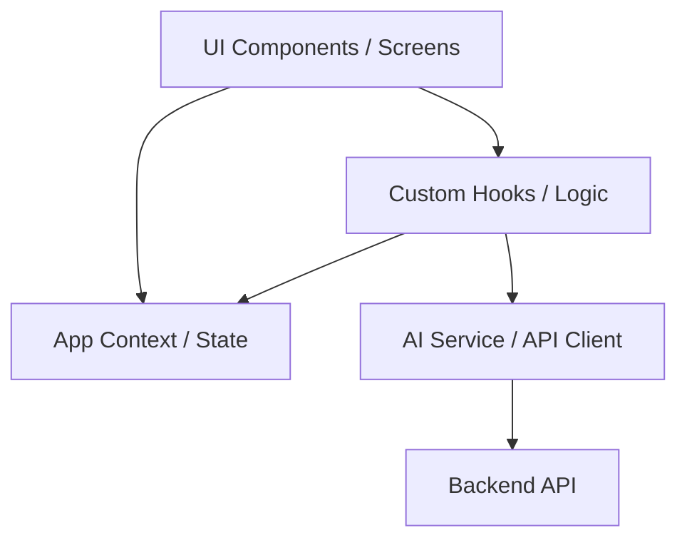

# C4 Component: Frontend Application (v1.3.0)

## 1. Overview
The Frontend is a highly interactive React SPA designed for high performance and low-latency AI interactions.

## 2. Key Components

### 2.1 Resume Editor (`Editor.tsx`)
- **Role**: Structured Data Input.
- **Responsibilities**:
    - Manages nested forms for work experience, education, and skills.
    - Synchronizes state with `app-context.tsx` for real-time previews across templates.

### 2.2 AI Analysis Workflow (`AiAnalysis.tsx`)
- **Role**: Intelligent Process Management.
- **Responsibilities**:
    - Orchestrates the sequence: JD Input -> Resume Diagnosis -> Score Reporting.
    - Integrates the **Interview Chat** sub-system.

### 2.3 Interview Chat System (`ChatPage.tsx`)
- **Role**: Conversational Interface.
- **Responsibilities**:
    - **Thinking Indicator**: New UX component providing feedback during AI processing.
    - **Stream Handler**: Processes Server-Sent Events (SSE) from the backend.
    - **Voice Integration**: Interfaces with `useInterviewVoice` for speech-to-text.

### 2.4 Data & State Layer (`hooks/`, `src/app-context.tsx`)
- **`useInterviewChat`**: Hook managing the state of the active interview session and message history.
- **`app-context.tsx`**: Centralizes global state including `resumeData` and `userProfile`.

## 3. Component Interaction Diagram

