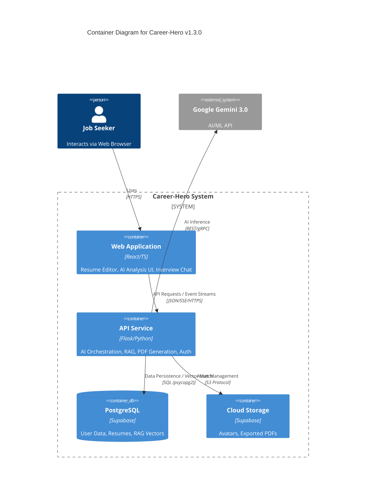

# C4 Container: Career-Hero v1.3.0

## Overview
Career-Hero's architecture is a decoupled multi-tier system designed for high responsiveness and modularity.

## Containers

### 1. **Web Application (Frontend)**
- **Name**: Frontend SPA (`ai-resume-builder`)
- **Technology**: React 18, TypeScript, Vite, Tailwind CSS, Framer Motion.
- **Role**:
    - **User Interface**: Handles complex resume editing and real-time previews.
    - **AI Interaction**: Manages streaming (SSE) response handling for chat.
    - **State Management**: Uses React Context and custom hooks for persistent editing sessions.

### 2. **API Application (Backend)**
- **Name**: Backend Service (`backend`)
- **Technology**: Python 3.12, Flask 3.0, Gunicorn.
- **Internal Modules (Services)**:
    - **`ai_endpoint_service`**: Orchestrates model interaction (Gemini 3.0).
    - **`rag_service`**: Implements industry-adaptive RAG strategy.
    - **`pdf_service`**: Headless browser (Playwright) rendering for PDF export.
    - **`auth_user_service`**: JWT-based identity management.
- **Role**:
    - Acts as a gateway between the frontend and external AI/BaaS services.
    - Enforces PII protection and domain-specific business logic.

### 3. **Managed Database (Supabase)**
- **Technology**: PostgreSQL + pgvector.
- **Role**:
    - Stores structured resume data (JSONB) and user profiles.
    - Hosts 3072-dimensional vector embeddings for RAG retrieval.

### 4. **Object Storage (Supabase Storage)**
- **Role**: Stores binary assets, including user avatars and exported PDF files.

## Diagram

