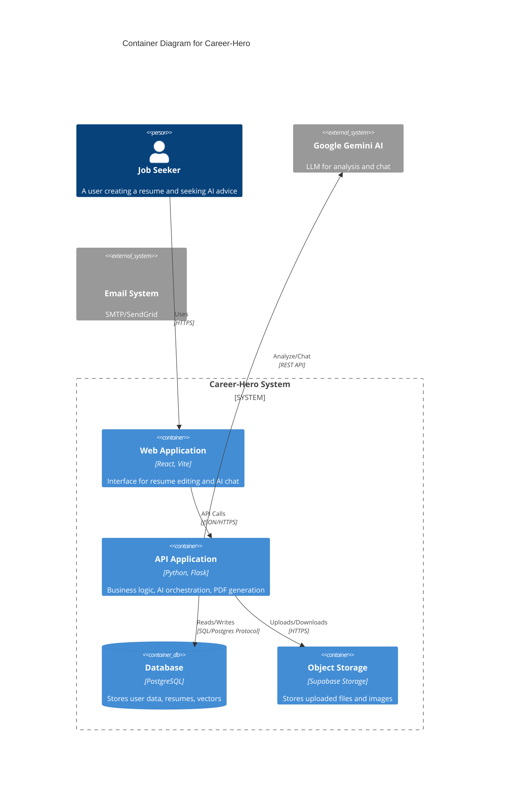

# C4 Container: Career-Hero Application

## Overview
- **Name**: Career-Hero Application
- **Type**: Web Application Stack
- **Technology**: Python (Backend), React/TypeScript (Frontend), PostgreSQL (Database)
- **Description**: A comprehensive platform for job seekers to build professional resumes, receive AI-driven feedback, and simulate job interviews.

## Containers

### 1. **Web Application (Container)**
- **Name**: Frontend Web App (`ai-resume-builder`)
- **Technology**: React 18, Vite, TypeScript, Tailwind CSS
- **Deployment**: Static Site Hosting (Vercel/Netlify) or Docker Nginx.
- **Description**: Client-side application providing resume editing, real-time preview, and interactive AI chat features.
- **Role**:
    - Manage user sessions via JWT stored in cookie/localStorage.
    - Interact with backend APIs for data persistence and AI logical processing.
    - Render complex resume layouts for PDF export.

### 2. **API Application (Container)**
- **Name**: Backend API Service (`backend`)
- **Technology**: Python 3.12, Flask 3.0, Gunicorn, Gevent
- **Deployment**: Docker Container (Render/Railway), PaaS.
- **Description**: RESTful API handling business logic, authentication, AI integration, and file generation.
- **Role**:
    - **Authentication Service**: Manage user identity and security.
    - **Resume Service**: CRUD operations for resume data.
    - **AI Orchestrator**: Interface with Google Gemini for sophisticated analysis.
    - **PDF Generator**: Headless browser (Playwright) service for high-quality exports.

### 3. **Database (Container/SaaS)**
- **Name**: Production Database
- **Technology**: PostgreSQL (via Supabase)
- **Deployment**: Managed Database Service.
- **Description**: Relational database storing user profiles, resumes, parsed data, and logs.
- **Role**:
    - **Persistence**: ACID-compliant storage for critical user data.
    - **Vector Search (pgvector)**: Enable semantic search for RAG (Retrieval-Augmented Generation) features.

### 4. **Storage (Container/SaaS)**
- **Name**: Object Storage
- **Technology**: S3-compatible (via Supabase Storage)
- **Deployment**: Managed Storage Service.
- **Description**: Repository for user uploaded files (PDF/DOCX resumes, avatars).
- **Role**:
    - **File Hosting**: Serve static assets and user uploads securely.

## Diagram

## Infrastructure
- **CI/CD**: GitHub Actions (assumed standard).
- **Deployment**: 
    - Frontend: Static hosting (global CDN).
    - Backend: Containerized service with auto-scaling (e.g., Render/Railway).
- **Security**: JWT for API auth, Row Level Security (RLS) on Supabase (optional/recommended), HTTPS everywhere.
