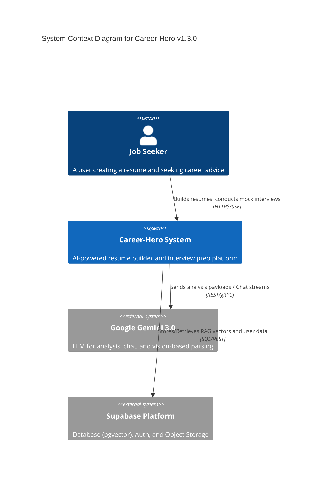

# C4 Context: Career-Hero System (v1.3.0)

## 1. System Overview
- **Name**: Career-Hero
- **Description**: An AI-powered, high-productivity resume builder and career coaching platform. It helps job seekers create optimized, ATS-friendly resumes and prepare for interviews using **Google Gemini 3.0** and **Vector RAG** technology.
- **Value Proposition**:
    - **Intelligent Analysis**: Multi-dimensional scoring and suggestions based on Gemini 3.0 Pro.
    - **Industry-Specific RAG**: Precision optimization for technical, financial, and supply chain domains using vector similarity search.
    - **Immersive Interviews**: Simulated HR interviews with streaming response and voice support.
    - **High-Fidelity Export**: 100% style-accurate PDF generation via Playwright.

## 2. Personas (Users)

### 2.1 Job Seeker (Human User)
- **Description**: Individuals (students to professionals) looking for employment.
- **Key Activities**:
    - Managing resumes with a WYSIWYG editor.
    - Uploading Job Descriptions (JD) for targeted analysis.
    - Engaging in AI-driven mock interviews.
    - Exporting professional, ATS-friendly PDFs.

### 2.2 System Developer / Admin
- **Description**: Technical personnel maintaining the platform.
- **Goals**: Monitor AI accuracy, manage RAG corpus, and optimize system performance.

## 3. System Features

### 3.1 Smart Resume Builder
- Interactive editor with real-time preview and multi-template support (Modern, Classic, Minimal).

### 3.2 AI Analysis & RAG Optimization
- Analyzes resumes against JDs.
- Uses **Supabase pgvector** to retrieve high-performing industry cases for context-aware suggestions.

### 3.3 AI Interview Simulation
- Conversational chat with simulated HR questions, incorporating the new **Thinking Indicator** for better UX flow.

### 3.4 Headless PDF Export
- Server-side rendering using Playwright to ensure consistent, high-quality output.

## 4. External Systems

### 4.1 Google Gemini AI (LLM & Vision)
- **Engine**: Gemini 3.0 (Pro/Flash).
- **Purpose**: Powering resume parsing, analysis, interview chat, and OCR for image-based JDs.

### 4.2 Supabase (BaaS)
- **Services**: PostgreSQL (Database), Auth (JWT), and Storage (Avatars/PDFs).
- **Vector Search**: `pgvector` for RAG implementation.

## 5. System Context Diagram

