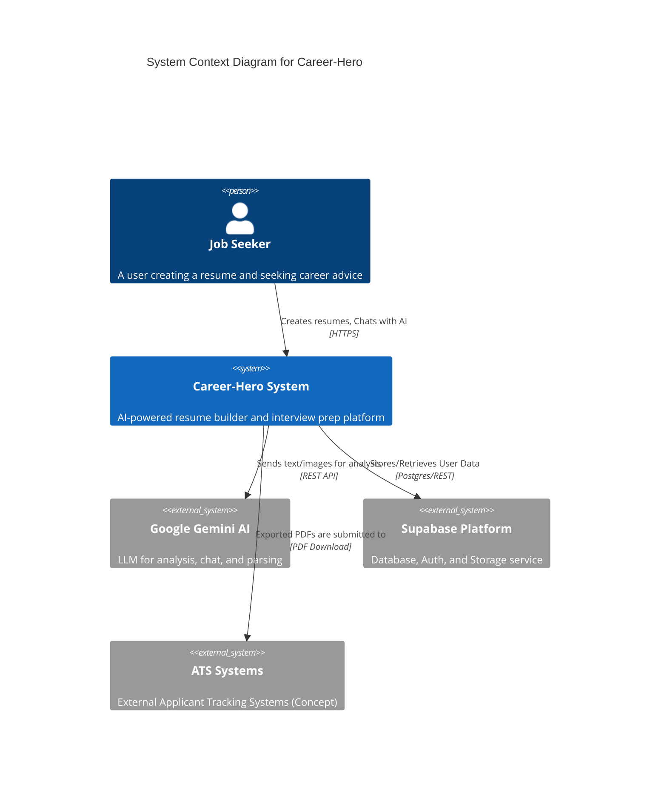

# C4 Context: Career-Hero System

## 1. System Overview
- **Name**: Career-Hero
- **Description**: An AI-powered resume builder and career coaching platform designed to help job seekers create optimized, ATS-friendly resumes and prepare for interviews through simulated AI conversations.
- **Value Proposition**:
    - Reduces time-to-market for job seekers by automating resume formatting.
    - Provides instant, actionable feedback on resume content using advanced LLMs (Gemini).
    - Simulates realistic interview scenarios to build candidate confidence.
    - Generates high-quality PDF exports that pass Applicant Tracking Systems (ATS).

## 2. Personas (Users)

### 2.1 Job Seeker (Human User)
- **Description**: Individuals looking for employment, ranging from students to experienced professionals.
- **Goals**:
    - Create a professional resume quickly.
    - Receive feedback on resume content and structure.
    - Practice interview questions tailored to specific job descriptions.
    - Download a polished PDF resume for applications.
- **Key Activities**:
    - Creating/Importing resumes.
    - Editing sections (Work Experience, Education, Skills).
    - Engaging with AI Chat for analysis and mock interviews.
    - Exporting PDF resumes.

### 2.2 Career Coach / Admin (Human User - Concept)
- **Description**: Platform administrators or career coaches monitoring system usage and content quality.
- **Goals**: Ensure platform stability, user satisfaction, and AI accuracy.
- **Key Activities**: User management, feedback review, template updates.

## 3. System Features

### 3.1 Resume Builder
- **Description**: A WYSIWYG editor for creating structured resumes with real-time preview and template switching.
- **Target User**: Job Seeker.

### 3.2 AI Analysis & Optimization
- **Description**: Analyzes resume content against industry standards and specific job descriptions (JD), providing a score and actionable improvement suggestions.
- **Target User**: Job Seeker.

### 3.3 AI Mock Interview
- **Description**: A conversational interface where users can practice answering interview questions generated based on their resume and target JD, with optional voice support.
- **Target User**: Job Seeker.

### 3.4 PDF Export
- **Description**: Generates a high-quality, ATS-friendly PDF version of the resume.
- **Target User**: Job Seeker.

## 4. External Systems

### 4.1 Google Gemini AI (LLM Provider)
- **Type**: External AI Service (API).
- **Description**: Provides the underlying intelligence for resume parsing, content generation, scoring, and conversational chat.
- **Integration**: REST API via `google-generativeai` SDK.
- **Purpose**: Core engine for "smart" features.

### 4.2 Supabase (BaaS Platform)
- **Type**: Database & Auth Provider.
- **Description**: Provides PostgreSQL database, authentication services, and object storage.
- **Integration**: `supabase-py` and `supabase-js` libraries.
- **Purpose**: Secure user data persistence, authentication management, and file storage.

### 4.3 Payment Gateway (Future/Concept)
- **Type**: Financial Service (e.g., Stripe/PayPal).
- **Description**: Would handle subscriptions for premium features (AI usage limits, premium templates).
- **Integration**: API.
- **Purpose**: Revenue generation.

## 5. System Context Diagram

## 6. Related Documentation
- [Container Documentation](./c4-container.md)
- [Backend Code Architecture](./c4-code-backend.md)
- [Frontend Code Architecture](./c4-code-frontend.md)
