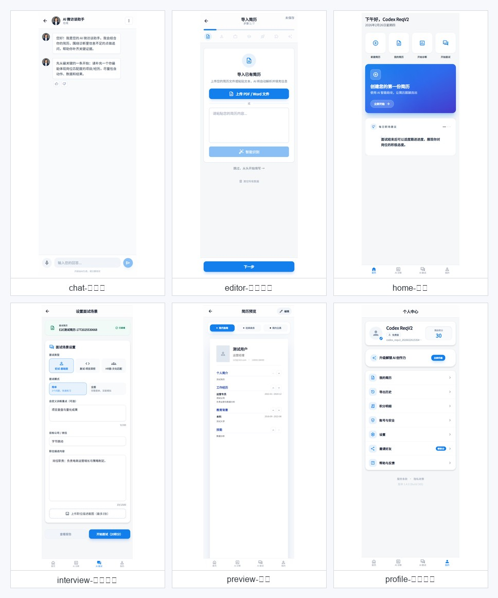
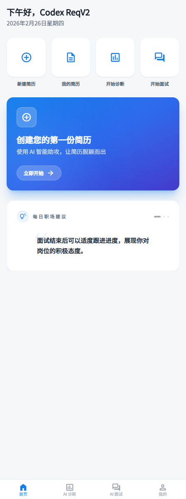
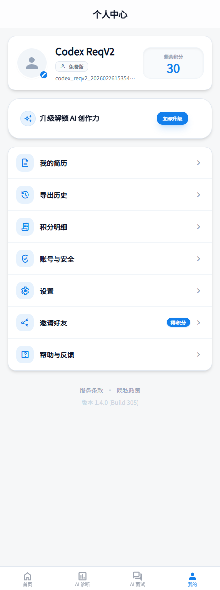
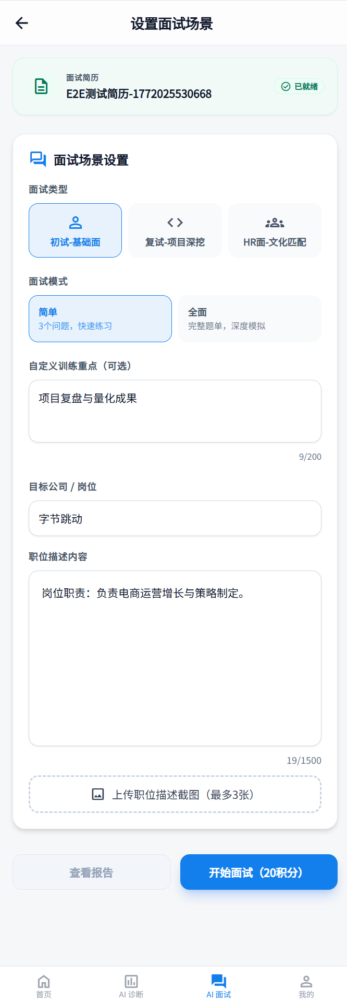
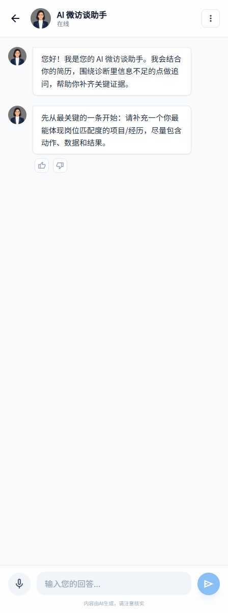
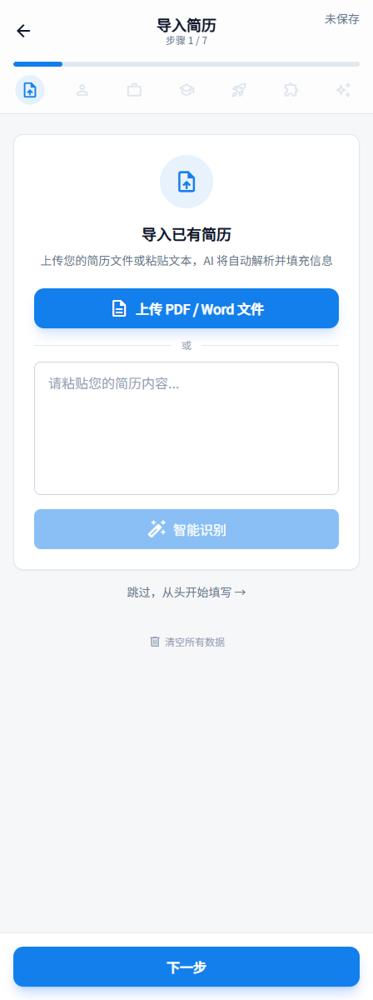
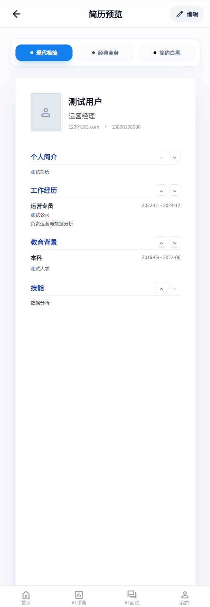

# Career Hero - AI Resume Builder 🚀

一个基于 React 和 Flask 的高生产力智能简历构建器，集成了 **Google Gemini 3.0** 顶尖模型、**Vector RAG** 行业增强、实时 **AI 面试模拟** 以及高保真 **PDF/图像 导出** 引擎。

---

## ✨ 核心功能

- 🤖 **AI 深度分析** - 基于 **Gemini 3.0** 的简历多维度评估与智能润色建议。
- 🔍 **Vector RAG 增强** - 集成 Supabase `pgvector` 与语义检索，针对 **技术/财务/供应链** 等硬核行业实现定制化深度优化。
- 🎙️ **沉浸式 AI 面试** - 模拟真实 HR 提问，支持**流式文本**交互与**多模态语音**识别。
- 📈 **专业商务报告** (NEW!) - 自动生成结构化的面试反馈报告，采用模块化卡片设计，涵盖亮点、改进建议及个性化训练计划。
- 🎯 **精准人岗匹配** - 深度解析 JD (职位描述)，提供精准的技能缺口分析与面试突破点。
- 📊 **多维导出引擎** - 支持高保真 **PDF 导出** (后端驱动) 及 **面试报告超长图导出** (前端驱动)。
- 🎨 **多模板预览** - 提供 Modern, Classic 及 Minimal 风格，实时切换，所见即所得。
- 🔐 **企业级安全** - 完善的 JWT 认证及 **PII (个人隐私信息) 脱敏保护**。

---

## 🏗️ 项目架构

项目采用前后端分离的现代化架构，所有核心逻辑均已模块化解耦，具备高度的可扩展性。

### 技术栈
| 领域 | 技术方案 |
| :--- | :--- |
| **前端** | React 18 / TypeScript / Vite / Tailwind CSS / Zustand / Framer Motion |
| **后端** | Python 3.12 / Flask 3.0 / Gunicorn (Async Gevent) / Playwright |
| **AI Engine** | Google Gemini 3.0 (Flash/Vision/Embedding) |
| **Data/Auth** | Supabase (PostgreSQL + Auth + Storage) |
| **Vector Search** | pgvector (Vector Similarity Search) |

### 模块结构
```text
Career-Hero/
├── ai-resume-builder/          # React 前端
│   ├── src/                    # 核心逻辑 (State, API, Store)
│   ├── components/             # UI 组件库 (Screens, Page Parts, UI Kit)
│   └── hooks/                  # 自定义 Hook (Chat, Feedback, Reset Actions)
├── backend/                    # Flask 后端
│   ├── app.py                  # API 路由网关
│   ├── services/               # 核心服务 (AI, Auth, PDF, RAG)
│   └── requirements.txt        # 环境依赖
├── database/                   # 数据库模式与迁移脚本
└── C4-Documentation/           # 详尽的 C4 架构文档 (Context -> Code)
```

---

## 📸 关键页面截图

登录态关键页面拼图：



以下为对应缩略图（预览页已修正为不含错误底部导航的版本）：

| 首页 | 个人中心 | 面试场景选择页 |
| :---: | :---: | :---: |
|  |  |  |

| 聊天页 | 简历编辑 | 预览 |
| :---: | :---: | :---: |
|  |  |  |

---

## 🚀 快速开始

### 1. 环境准备
- **Node.js 18+** & **Python 3.12+**
- **Supabase** 账号及项目 (开启 `pgvector` 扩展)

### 2. 环境配置

#### 后端 (`backend/.env`)
```env
SUPABASE_URL=your_url
SUPABASE_KEY=your_key
JWT_SECRET=your_secret
GEMINI_API_KEY=your_gemini_key

# 细粒度模型控制
GEMINI_RESUME_PARSE_MODEL=gemini-3-flash-preview
GEMINI_ANALYSIS_MODEL=gemini-3-pro-preview
GEMINI_INTERVIEW_MODEL=gemini-3-pro-preview
```

#### 前端 (`ai-resume-builder/.env`)
```env
VITE_API_BASE_URL=http://localhost:5000
```

### 3. 运行项目
```bash
# 后端启动
cd backend && pip install -r requirements.txt && python app.py

# 前端启动
cd ai-resume-builder && npm install && npm run dev
```

### 4. 运行标准测试入口
```bash
# 一次运行前后端测试
npm test

# 仅前端
npm run test:frontend

# 仅后端（首次建议先安装开发测试依赖）
pip install -r backend/requirements-dev.txt
npm run test:backend
```

### 5. 每步回归测试（本地 + 线上）
```powershell
# 建议先设置测试账号环境变量（避免命令行明文）
$env:CAREER_HERO_TEST_EMAIL="your-test-email@example.com"
$env:CAREER_HERO_TEST_PASSWORD="your-test-password"

# 每一步改动后执行（本地测试 + 线上烟测 + UI登录）
pwsh -File scripts/test-step.ps1 `
  -FrontendUrl "https://your-frontend.vercel.app/" `
  -BackendUrl "https://your-backend.up.railway.app"

# 如需仅跑线上：
pwsh -File scripts/test-online.ps1 `
  -FrontendUrl "https://your-frontend.vercel.app/" `
  -BackendUrl "https://your-backend.up.railway.app"
```

---

## 📝 更新日志

### v1.4.0 (2026-02-20) - 商务级面试报告与交互连续性 ✨
- **🎨 专业面试报告 UI 重构**：
  - **模块化卡片布局**：引入“大卡片套小卡片”的商务报表设计，将亮点、改进点、匹配度、训练计划等信息进行结构化解耦。
  - **高级排版系统**：优化了长文本总结的阅读节奏，支持自动段落拆分、两端对齐及 `leading-[1.8]` 舒缓行间距。
  - **SVG 图标系统**：引入定制化 `ReportIcon` 系统，确保在深浅色模式下均有极佳的清晰度。
- **🧠 智能分析解析引擎**：
  - **模板化解析策略**：针对 AI 输出的多种格式（标题式、列表式、Markdown式）实现了鲁棒的严格解析与回退机制。
  - **问题-改进-练习 (PIP) 模型**：改进项不再是简单的列表，而是按照“发现问题 -> 改进策略 -> 建议练习”三联排方式展示，极具实战指导性。
  - **文本去重算法**：实现了基于语义的句子级别去重，确保 AI 总结内容简洁精准。
- **🔄 会话稳定性与持久化**：
  - **体验防中断逻辑**：在进行简历更新、重新诊断等操作时，智能识别并保留已有的面试会话结果，实现“分析-练习-分析”的丝滑链路。
  - **时间戳对齐**：优化了 Resume 更新逻辑，确保数据的 `updated_at` 属性能够真实反映用户资产的变化。

### v1.3.1 (2026-02-17) - 交互精细化
- **🎨 毛玻璃进度条**：采用拟态设计，增加流光渐变与呼吸灯动效。
- **⚡ 零延迟热身逻辑**：进入面试立即展示热身题，后台静默并行加载后续题库。
- **💎 全局模态框**：自研自定义高颜值弹出层，全面替代原生 `confirm` 系统。

### v1.3.0 (2026-02-17) - 架构升级
- **🏗️ Service 模块解耦**：核心逻辑彻底由 `app.py` 迁移至 `services/`，实现高内聚低耦合。
- **📄 C4 文档体系**：引入了从 Context 到 Code 的全链路架构文档。

---

## 📄 许可证
本项目采用 [MIT 许可证](LICENSE)。

---

⭐ 如果 Career Hero 对您有帮助，请在 GitHub 上给我们一个 Star！
